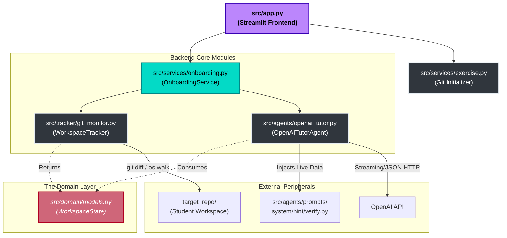

# Architecture Breakdown: Over-the-Shoulder Tutor

This document maps out the "Clean Architecture" we implemented. By decoupling the codebase into Domain, Services, Trackers, and Agents, the platform remains highly scalable, testing-friendly, and maintainable.

---

## 1. High-Level Data Flow

The Streamlit UI acts strictly as a presentation layer. It offloads all business logic to the `OnboardingService`.

---

## 2. Directory & Module Breakdown

### The Presentation Layer (`src/app.py`)
This is the Streamlit dashboard that the judges and students see. 
- **Responsibility:** Capturing user chat messages, triggering UI Hint/Check Solution lockdowns, maintaining session-state (`is_solved` tracker), and printing the LLM streams.
- **Dependencies:** It knows *nothing* about Git or OpenAI. It simply imports `OnboardingService`.

### The Controller Layer (`src/services/onboarding.py`)
This is the coordinator or "Glue code".
- **Responsibility:** Orchestrating the request. When a student asks a query or requests a Hint, it tells the tracker to "get the latest context", and passes that context to the Agent.

### The Infrastructure Modules

#### A. Workspace Tracker (`src/tracker/git_monitor.py`)
- **Responsibility:** Evaluates `git diff` out of `target_repo/` via Python `subprocess`, finds the active python file, and uses `os.walk` to generate an ASCII **directory tree** of the repository. It wraps this data into a core `WorkspaceState` Domain object.

#### B. The Agent (`src/agents/openai_tutor.py`)
- **Responsibility:** Handling the OpenAI API streams. It also contains the secondary `verify_solution` method which forces OpenAI into structured JSON mode to act as an automated grader.

### Core Architecture Utilities

#### C. Local Git Branching (`src/services/exercise.py`)
- Automatically initializes the student workspace using realistic git patterns (e.g. creating a pristine `main` branch, then checking out `exercise/auth-broken` so `git diff` correctly logs the delta of the student's uncommitted work).

#### D. Dynamic Prompts (`src/agents/prompts/*.py`)
- Replaces static `.txt` prompts with Python generators. `system_prompt`, `hint`, and `verify` ingest the `WorkspaceState` Domain objects to populate the f-strings. This guarantees the LLM runs inferences against precise live-time states.

#### E. The Domain Layer (`src/domain/models.py`)
- Defines what our data strictly looks like using `baseModel` validations (`WorkspaceState`, `Speciality`). It prevents "Stringly Typed" context bugs across our application surface.

---

## 3. The End-Game Lifecycle (Check Solution)

1. **User Request:** The student clicks **✅ Check Solution**.
2. **State Generation:** Streamlit invokes `service.verify_solution()`, capturing local IDE files.
3. **AI Code Review:** `openai_tutor.py` passes the codebase to the LLM using the rigorously strict criteria inside `verify.py`. The LLM returns a strict JSON object `{"solved": true/false}`.
4. **Win State Execution:** If True, `app.py` triggers balloons, sets `st.session_state.is_solved = True`, completely disables the Hint buttons, and locks the Chat Input.
5. **Auto-Unlock:** If the student alters the file again, `app.py` registers a hash change on `git_diff` and instantly unlocks the UI for them to experiment.

---

## 4. Future Scope & Next Steps 🚀

Once this solid foundational "Local Mock Repo" MVP is battle-tested, the ultimate vision for the product is dynamic ingestion of real Repositories:

### 1. Dynamic GitHub Repository Cloning
Add a **"Import Repo"** text field to the Streamlit UI. The backend would:
- Use python `subprocess` to `git clone` a public URL.
- Process the entire repository dynamically instead of our mocked local `target_repo/`.

### 2. Generative Agent Workloads (Exercise Creator)
Rather than manually creating Python mock applications and writing static `verify.py` validation rules:
- Provide an LLM with the student's `Speciality` profile and the cloned GitHub repository tree.
- Have the LLM **automatically isolate a file**, slice out a crucial block of code, and commit the breakage to a new branch.
- Have the LLM **dynamically write** the `verify.py` strict JSON requirements based on the code snippet it just removed.
This essentially creates infinite, procedurally generated onboarding exercises tailored directly to that day's repository!
